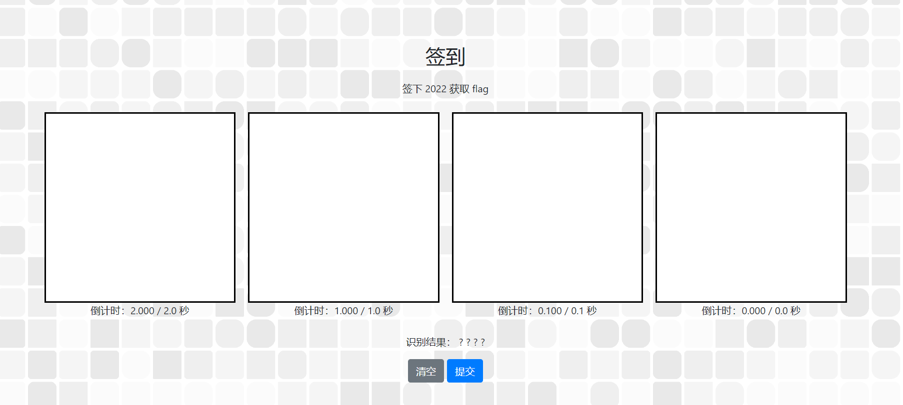
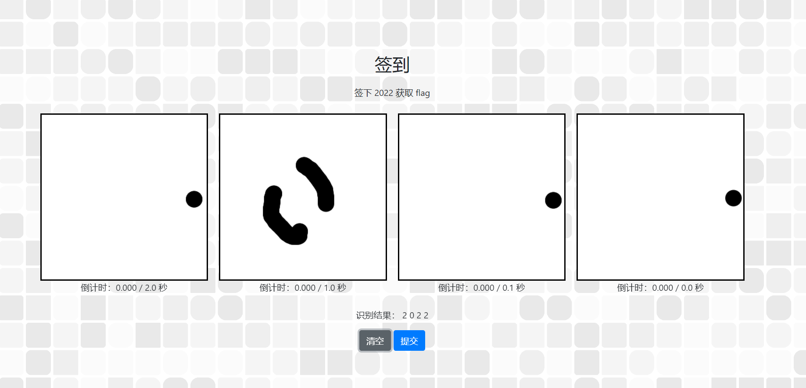
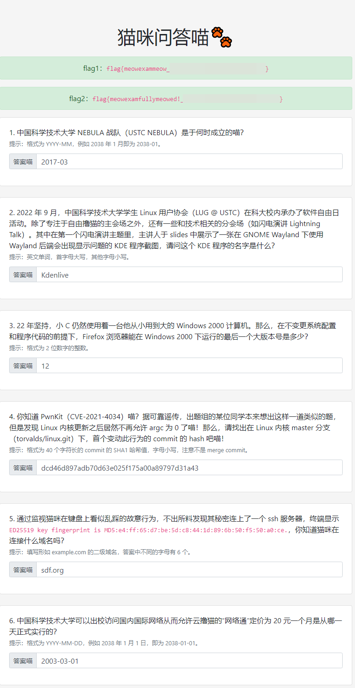
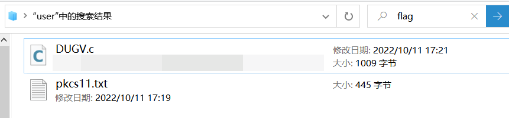
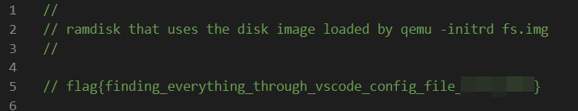

# Hackergame2022_Writeup

### **写在文前**

本文记录笔者参与中国科学技术大学第九届信息安全大赛（Hackergame2022）提交的flags以及解题思路。已开放Dicussions欢迎讨论~~我猜没人看~~

本人并非网络安全专业出身，基于机缘巧合有幸了解到科大的Hackergame，参与过Hackergame2021以及Hackergame2022。
第一次公开提交Writeup，但本人解答的题目并不多，解题思路并不是最佳方案，旨在记录个人在CTF领域学习历程。
完成题目 `签到` `猫咪问答喵`  `家目录里的秘密` `HeiLang` `Xcaptcha` `旅行照片 2.0` `猜数字` `LaTeX 机器人(纯文本)` `线路板`

---


### ****官方题解**

该部分引用自项目 🔗[hackergame2022-writeups](https://github.com/USTC-Hackergame/hackergame2022-writeups) [版权申明](https://github.com/USTC-Hackergame/hackergame2022-writeups#%E7%89%88%E6%9D%83%E5%A3%B0%E6%98%8E)

部分题目需要使用 Token。Token 可以从比赛平台注册获取，也可以使用 `1:MEUCIQC24dB6B24/LDr2O+4cifbzOEFDbkXg3hJIqTXuuvpa1QIgbzMM/F0uUmYIudtM6qEDvOpEHbtTZjSjTWMcA5zhnos=` 作为测试 token。

| 题目描述与 write-up                                                | 文件、源代码                                            |
| ------------------------------------------------------------ | ------------------------------------------------------- |
| [🔗签到](https://hack.lug.ustc.edu.cn/#%E7%AD%BE%E5%88%B0) | - |
| [🔗猫咪问答喵](https://hack.lug.ustc.edu.cn/#%E7%8C%AB%E5%92%AA%E9%97%AE%E7%AD%94%E5%96%B5) | - |
| [🔗家目录里的秘密](https://hack.lug.ustc.edu.cn/#%E5%AE%B6%E7%9B%AE%E5%BD%95%E9%87%8C%E7%9A%84%E7%A7%98%E5%AF%86) | [文件、源代码](official/家目录里的秘密/src) |
| [🔗HeiLang](https://hack.lug.ustc.edu.cn/#HeiLang) | [文件、源代码](official/HeiLang/src) |
| [🔗Xcaptcha](https://hack.lug.ustc.edu.cn/#Xcaptcha) | [文件、源代码](official/Xcaptcha/src) |
| [🔗旅行照片 2.0](https://hack.lug.ustc.edu.cn/#%E6%97%85%E8%A1%8C%E7%85%A7%E7%89%87%202.0) | [文件、源代码](official/旅行照片%202.0/src) |
| [🔗猜数字](https://hack.lug.ustc.edu.cn/#%E7%8C%9C%E6%95%B0%E5%AD%97) | [文件、源代码](official/猜数字/src) |
| [🔗LaTeX 机器人](https://hack.lug.ustc.edu.cn/#LaTeX%20%E6%9C%BA%E5%99%A8%E4%BA%BA) | [文件、源代码](official/LaTeX%20机器人/src) |
| [📁Flag 的痕迹](official/Flag%20的痕迹/README.md) | [文件、源代码](official/Flag%20的痕迹/src) |
| [📁安全的在线测评](official/安全的在线测评/README.md) | [文件、源代码](official/安全的在线测评/src) |
| [🔗线路板](https://hack.lug.ustc.edu.cn/#%E7%BA%BF%E8%B7%AF%E6%9D%BF) | [文件、源代码](official/线路板/src) |
| [📁Flag 自动机](official/Flag%20自动机/README.md) | [文件、源代码](official/Flag%20自动机/src) |
| [📁微积分计算小练习](official/微积分计算小练习/README.md) | [文件、源代码](official/微积分计算小练习/src) |
| [📁杯窗鹅影](official/杯窗鹅影/README.md) | [文件、源代码](official/杯窗鹅影/src) |
| [📁蒙特卡罗轮盘赌](official/蒙特卡罗轮盘赌/README.md) | [文件、源代码](official/蒙特卡罗轮盘赌/src) |
| [📁二次元神经网络](official/二次元神经网络/README.md) | [文件、源代码](official/二次元神经网络/src) |
| [📁惜字如金](official/惜字如金/README.md) | [文件、源代码](official/惜字如金/src) |
| [📁不可加密的异世界](official/不可加密的异世界/README.md) | [文件、源代码](official/不可加密的异世界/src) |
| [📁置换魔群](official/置换魔群/README.md) | [文件、源代码](official/置换魔群/src) |
| [📁光与影](official/光与影/README.md) | [文件、源代码](official/光与影/src) |
| [📁矩阵之困](official/矩阵之困/README.md) | [文件、源代码](official/矩阵之困/src) |
| [📁你先别急](official/你先别急/README.md) | [文件、源代码](official/你先别急/src) |
| [📁链上记忆大师](official/链上记忆大师/README.md) | [文件、源代码](official/链上记忆大师/src) |
| [📁片上系统](official/片上系统/README.md) | [文件、源代码](official/片上系统/src) |
| [📁传达不到的文件](official/传达不到的文件/README.md) | [文件、源代码](official/传达不到的文件/src) |
| [📁看不见的彼方](official/看不见的彼方/README.md) | [文件、源代码](official/看不见的彼方/src) |
| [📁量子藏宝图](official/量子藏宝图/README.md) | [文件、源代码](official/量子藏宝图/src) |
| [📁《关于 RoboGame 的轮子永远调不准速度这件事》](official/《关于%20RoboGame%20的轮子永远调不准速度这件事》/README.md) | [文件、源代码](official/《关于%20RoboGame%20的轮子永远调不准速度这件事》/src) |
| [📁壹...壹字节？](official/壹...壹字节？/README.md) | [文件、源代码](official/壹...壹字节？/src) |
| [📁企鹅拼盘](official/企鹅拼盘/README.md) | [文件、源代码](official/企鹅拼盘/src) |
| [📁小 Z 的靓号钱包](official/小%20Z%20的靓号钱包/README.md) | [文件、源代码](official/小%20Z%20的靓号钱包/src) |
| [📁火眼金睛的小 E](official/火眼金睛的小%20E/README.md) | [文件、源代码](official/火眼金睛的小%20E/src) |
| [📁evilCallback](official/evilCallback/README.md) | [文件、源代码](official/evilCallback/src) |

<br>
<br>

---  

<br>

### **0x00签到** 

<br>

作为签到题题目难度必然不大。题目存在四个画板，要求在规定时间内完在其中写出数字，并交由系统识别。规定时间分别为 `2.0s` `1.0s` `0.1s` `0.0s`，我们 **很难** 直接完成 （可以）

我们不妨随意写一些数字，识别为 `?10?` 并点击提交。观察地址栏 `http://202.38.93.111:12022/?result=?10?`可以发现采用`get`方式提交参数。
依题意在地址栏构造请求如下`http://202.38.93.111:12022/?result=2022`
成功获得flag `flag{HappyHacking2022-**********}`

**很难但不是不行**
前文说到很难直接写出来，但是我们可以充分利用OCR的鲁棒性......

~~欸嘿~~

---

<br>

### **0x01猫咪问答喵🐾**

<br>

作为传统开篇题目一定继承了前几年的解题套路。在浏览题目前我默默打开了 🔗[LUG @ USTC](https://lug.ustc.edu.cn/) 主页。

1. **中国科学技术大学 NEBULA 战队（USTC NEBULA）是于何时成立的喵？**

    - 直接搜索`NEBULA 战队（USTC NEBULA）是于何时成立`得到答案`2017-03`


2. **2022 年 9 月，中国科学技术大学学生 Linux 用户协会（LUG @ USTC）在科大校内承办了软件自由日活动。除了专注于自由撸猫的主会场之外，还有一些和技术相关的分会场（如闪电演讲 Lightning Talk）。其中在第一个闪电演讲主题里，主讲人于 slides 中展示了一张在 GNOME Wayland 下使用 Wayland 后端会出现显示问题的 KDE 程序截图，请问这个 KDE 程序的名字是什么？**

    - 首先查看预先打开的🔗[LUG @ USTC](https://lug.ustc.edu.cn/) 站内检索`软件自由日活动`时间锁定在2022 年 9 月
页面内检索` Wayland`无果 (坏欸) 开始阅读页面。留意到第一段提及B站直播，并检索到直播回放 ▶ [BV11e411M7t9](https://www.bilibili.com/video/BV11e411M7t9)
看目录直接空降闪电演讲`2：30：00`,接着拖动进度条根据预览图空降`2:42:05`，听了两遍确认为`Kdenlive`


3. **22 年坚持，小 C 仍然使用着一台他从小用到大的 Windows 2000 计算机。那么，在不变更系统配置和程序代码的前提下，Firefox 浏览器能在 Windows 2000 下运行的最后一个大版本号是多少？提示：格式为 2 位数字的整数。**

    - 大版本号为两位整数我们不妨手动尝试，结果为`12`


4. **你知道 PwnKit（CVE-2021-4034）喵？据可靠谣传，出题组的某位同学本来想出这样一道类似的题，但是发现 Linux 内核更新之后居然不再允许 argc 为 0 了喵！那么，请找出在 Linux 内核 master 分支（torvalds/linux.git）下，首个变动此行为的 commit 的 hash 吧喵！**

    - ~~答：不知道~~
    - 网页搜索 "linux 内核漏洞 grac 0" 得到 🔗[lwn.net](https://lwn.net/Articles/882799/)页面
进入`torvalds/linux`的commits中搜索`argc`并结上述合网页定位到22年二月 "exec: Force single empty string when argv is empty … kees committed on 2 Mar"
发现关键字段`Hopefully now that CVE-2021-4034 shows practical exploitative use[4]
of this bug in a shellcode, we can reconsider.`
确认是https://github.com/torvalds/linux/commit/dcd46d897adb70d63e025f175a00a89797d31a43
HASH1为`dcd46d897adb70d63e025f175a00a89797d31a43`

5. **通过监视猫咪在键盘上看似乱踩的故意行为，不出所料发现其秘密连上了一个 ssh 服务器，终端显示 ED25519 key fingerprint is MD5:e4:ff:65:d7:be:5d:c8:44:1d:89:6b:50:f5:50:a0:ce.，你知道猫咪在连接什么域名吗？**

    - 使用网页高级搜索题目强制包含所述md5字段
找到🔗[Github](https://gist.github.com/jandryuk/61b286220447300ba9dca0faa26526dd)页面
匹配字段有 
    - 六位不相同字母尝试第一个`sdf.org`提交正确
~~~
256 MD5:e4:ff:65:d7:be:5d:c8:44:1d:89:6b:50:f5:50:a0:ce ol.sdf.org (ED25519)
256 MD5:e4:ff:65:d7:be:5d:c8:44:1d:89:6b:50:f5:50:a0:ce mx.sdf.org (ED25519)
2048 MD5:6e:cd:53:4f:75:a1:e8:5b:63:74:32:4f:0c:85:05:17 mx.sdf.org (RSA)
2048 MD5:6e:cd:53:4f:75:a1:e8:5b:63:74:32:4f:0c:85:05:17 sdf.lonestar.org (RSA)
256 MD5:e4:ff:65:d7:be:5d:c8:44:1d:89:6b:50:f5:50:a0:ce sdf.lonestar.org (ED25519)
2048 MD5:6e:cd:53:4f:75:a1:e8:5b:63:74:32:4f:0c:85:05:17 bjork.sdf.org (RSA)
256 MD5:e4:ff:65:d7:be:5d:c8:44:1d:89:6b:50:f5:50:a0:ce bjork.sdf.org (ED25519)
2048 MD5:6e:cd:53:4f:75:a1:e8:5b:63:74:32:4f:0c:85:05:17 miku.sdf.org (RSA)
256 MD5:e4:ff:65:d7:be:5d:c8:44:1d:89:6b:50:f5:50:a0:ce miku.sdf.org (ED25519)
2048 MD5:6e:cd:53:4f:75:a1:e8:5b:63:74:32:4f:0c:85:05:17 faeroes.sdf.org (RSA)
256 MD5:e4:ff:65:d7:be:5d:c8:44:1d:89:6b:50:f5:50:a0:ce faeroes.sdf.org (ED25519)
2048 MD5:6e:cd:53:4f:75:a1:e8:5b:63:74:32:4f:0c:85:05:17 norge.sdf.org (RSA)
256 MD5:e4:ff:65:d7:be:5d:c8:44:1d:89:6b:50:f5:50:a0:ce norge.sdf.org (ED25519)
2048 MD5:6e:cd:53:4f:75:a1:e8:5b:63:74:32:4f:0c:85:05:17 iceland.sdf.org (RSA)
256 MD5:e4:ff:65:d7:be:5d:c8:44:1d:89:6b:50:f5:50:a0:ce iceland.sdf.org (ED25519)
~~~


6. **中国科学技术大学可以出校访问国内国际网络从而允许云撸猫的“网络通”定价为 20 元一个月是从哪一天正式实行的？**

    - 搜索引擎检索到相关文件`https://www.ustc.edu.cn/info/1057/4931.htm`依照文件尝试提交`2010-12-10``2011-1-1`但是都不对（坏欸）
    - 在解决了`Xcaptcha`后注意到原文引用了旧的文件 `〔2003〕1号《关于实行新的网络费用分担办法的通知》`
进入 `ustcent.usstc.edu.cn` 首页>官方文件>网字文件 找🔗[2003年文件](https://ustcnet.ustc.edu.cn/2003/0301/c11109a210890/page.htm)
`2003-03-01`



至此猫咪问答喵完美解决。笔者解决题号顺序为`1 2 5 3 4 6`。经历数次检索偏差和撞墙后~~顺利~~拿到flag 
`flag{meowexammeow_***************_**********}`
`flag{meowexamfullymeowed!_***************_**********}`

---

<br>

### **0x02 家目录里的秘密** 

<br>

#### **VSCode里的flag**
Windows文件管理器在`home`目录下检索`flag`，打开检索到的`DUGV.c`文件，第五行注释赫然写着`flag{finding_everything_through_vscode_config_file_********}`




#### **Rclone 里的 flag**

不难发现`\user_home\user\.config\rclone` 路径中的 `rclone.conf` 文件，该文件包含一个ftp连接配置。
```
[flag2]
type = ftp
host = ftp.example.com
user = user
pass = tqqTq4tmQRDZ0sT_leJr7-WtCiHVXSMrVN49dWELPH1uce-***********************************
```
既然写了`[flag2]`那么flag大概率在文件中，其中`pass`字段最可疑，猜测其为flag加密形式。加密方式猜测为rclone自带加密，既然能加密那么就一定能还原。经过网络检索得到加密算法。🔗[[LINK]](https://github.com/rclone/rclone/blob/v1.50.1/fs/config/obscure/obscure.go)
```go
//节选部分
// Reveal an obscured value
func Reveal(x string) (string, error) {
	ciphertext, err := base64.RawURLEncoding.DecodeString(x)
	if err != nil {
		return "", errors.Wrap(err, "base64 decode failed when revealing password - is it obscured?")
	}
	if len(ciphertext) < aes.BlockSize {
		return "", errors.New("input too short when revealing password - is it obscured?")
	}
	buf := ciphertext[aes.BlockSize:]
	iv := ciphertext[:aes.BlockSize]
	if err := crypt(buf, buf, iv); err != nil {
		return "", errors.Wrap(err, "decrypt failed when revealing password - is it obscured?")
	}
	return string(buf), nil
}
```
同样还可以检索到unobscure的方法：🔗[[LINK]](https://github.com/julianbrost/rclone-unobscure)，并把混淆数据丢进去跑一下。
```go
package main

import (
	"fmt"
	"github.com/rclone/rclone/fs/config"
	"github.com/rclone/rclone/fs/config/obscure"
)

func main() {
	for _, section := range config.FileSections() {
		pass := config.FileGet(section, "tqqTq4tmQRDZ0sT_leJr7-WtCiHVXSMrVN49dWELPH1uce-***********************************")
		fmt.Println(section, obscure.MustReveal(pass))
	}
}
```
成功取得flag`flag{get_rclone_password_from_config!_*******}`

---

<br>

### **0x03 HeiLang**

<br>

题目定义了一种新的赋值语句，用 `A[x | y | z] = t` 来表示之前**复杂**的 `A[x] = t; A[y] = t; A[z] = t`。 ~~（感觉特别像中学时期做的某些数学题）~~ 观察题目不难解读题意，只要根据题目提示正确赋值数组a即可。
本题笔者并没有使用任何编程语言处理语句，利用编辑器自带的替换功能，把 `|` 替换成 `] = a[` 从而重构赋值语句。跑一下脚本得出flag `flag{6d9ad6e9a6268d96-****************}`

---

<br>

### **0x04 Xcaptcha** 

<br>

captcha全自动区分计算机和人类的图灵测试，这种程序必须能生成并评价人类能很容易通过但计算机却通不过的测试。2038年Xcaptcha拦住了CTFers的去路.......

本题只需要在一秒内完成三个简单加法运算即可。基本思路使用Tampermonkey自动完成计算并提交，首先眼疾手快存储一份HTML文件，根据标签名称编写脚本。具体实现方法笔者给出一种如下：

```JavaScript
// ==UserScript==
// @name         I am a bot
// @namespace    Xcaptchat
// @version      0.1
// @description  -
// @author       -
// @match        http://202.38.93.111:10047/xcaptcha
// @require      http://ajax.aspnetcdn.com/ajax/jQuery/jquery-1.8.0.js
// ==/UserScript==

(function () {
    'use strict';

    var i = 1; //不懂Tampermonkey为什么不能在for中定义
    for (i; i <= 3; i++) {
        var q = $('label[for="captcha' + i + '"]').text().split(' ')[0].split('+'); //匹配
        var a = BigInt(q[0]) + BigInt(q[1]); //计算
        document.querySelector("#captcha" + i).value = a; //填写
    }
    document.getElementById('submit').click(); //提交

})();
```
现在点击验证Tampermonkey插件就会自动完成验证。Im a bot！

`flag{head1E55_br0w5er_and_ReQuEsTs_areallyour_FR1ENd_**********}`


---

<br>

### **0x05 旅行照片 2.0** 

<br>

Coming soon~

---

<br>

### **0x06 猜数字** 

<br>

Coming soon~

---

<br>

### **0x07 LaTeX 机器人(纯文本)** 

<br>

Coming soon~

---

<br>

### **0x08 线路板**

<br>

Coming soon~
